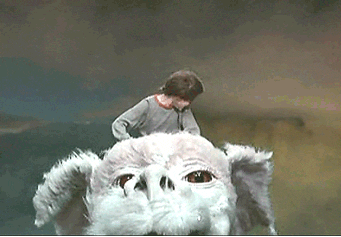

## Your *luck dragon* for OS signals

Our friend Falcor has journeyed to the farthest reaches of Fantasia, and like any luck dragon, knows how to listen for signals from beyond our world. This makes Falcor the perfect helper for binding functions to any `os.Signal` you'd like to handle. 

Once flying, your luck dragon will listen for signals from beyond the *Nothing*, and will execute the right functions at just the right time.

<p align="center"><br /><em>"Having a luck dragon with you is the only way to go on a quest!"</em> – Falcor</p>

### Installation

```bash
$ go get github.com/eyelight/falcor
```

```go
import (
    "github.com/eyelight/falcor"
)
```

### Usage

**Configure Falcor**

How talkative do you want your luck dragon?
```go
config := falcor.Config{
    Verbose: true,
} 
```

**Summon Falcor With Luck**

To configure Falcor initially, call `WithLuck()` and pass your config:
```go
func init() {
    artax := falcor.WithLuck(config)
}
```

Falcor is envisioned as a single luck dragon listening for any `os.Signal` your applicaton handles. So there is an unexported package level Dragon called `falcor`, and you can get a pointer to him again in a different scope, such as between your `init()` and `main()`. NOTE: Because falcor should be a singleton, you should probably only call `WithLuck()` once, especially if already configured & flying.

If you lose your pointer to falcor (eg, `artax` going out of scope in the swamp of sadness), you can get the same dragon back with `Luck()`.
```go
func main() {
    bastian := falcor.Luck()
}
```

**Gather your riders**

It's time to add handlers to any desired OS signal you'd like to handle. Let's handle an interrupt signal that will exit the program.
```go
bastian.Mount(syscall.SIGINT, "onInterrupt", func() {
    log.Println("Handling SIGINT...")
    os.Exit(0)
})
```

The signal `syscall.SIGINT` is now a "Rider" on our luck dragon. But falcor is not listening for signals just yet. For that, you need falcor to `Fly()`.

**Fly Your Luck Dragon**

Falcor listens for signals when he is flying:
```go
bastian.Fly()
```

Now, issuing an interrupt signal via Ctrl-X will cause falcor to execute the function we added using `Mount()`. 

**Multiple Handlers**

What if we'd like to add more functions to the same OS signal? Just call `Mount()` again, and additional functions will be bound to the rider.

**Execution Order**

Each of Falcor's Riders – each `os.Signal` passed to `Mount()` – has its own configurable execution order, with three strategies: `Concurrent`, `FIFO`, and `LIFO`. 

By default, Rider functions will be called concurrently with a goroutine at the time a signal is received. To execute sequentially, call the `Execution(mode)` meethod on a mounted Rider, identified by their signal.

```go
bastian.Rider(syscall.SIGINT).Execution(falcor.FIFO) // Mount order 
// or
bastian.Rider(syscall.SIGINT).Execution(falcor.LIFO) // reverse Mount order
```

Sequential execution order is based on the order of calls to `Mount()`, either queue-like with `FIFO` or stack-like with `LIFO`. 

To go back to concurrent execution, pass `falcor.Concurrent` (or simply don't journey to this area of Fantasia in the first place).

```go
bastian.Rider(syscall.SIGINT).Execution(falcor.Concurrent) // default
```

**Querying Riders**

If you need to know how many riders are mounted, just ask your luck dragon with `Riders()`:

```go
fmr.Printf("falcor has %v riders", bastian.Riders())
```

If you need to see the names of all the functions in a Rider, you can call `Sequence()` which will return a string containing all the Rider's functions, listed in order they were added to the function slice, separated by a character indicating execution order: ∞ for concurrent, → for FIFO, or ← for LIFO.

Let's imagine another luck dragon flying a SIGINT rider which has four functions attached.

```go
fmt.Printf("interrupt sequence: %s", atreyu.Rider(syscall.SIGINT).Sequence())
```
Outputs:
```bash
interrupt sequence: EXIT ← DUMPFILE ← BROKERHANGUP ← DBHANGUP
```

Above, the four functions are executing in LIFO mode, where EXIT is called last. They are nevertheless listed in order they were received via a call to `Mount()`.

**Dismounting**

To remove a function from a Rider, simply call `Dismount` with the appropriate signal and the function's label initially passed to `Mount`.

```go
bastian.Dismount(syscall.SIGINT, "onInterrupt")
```

Any time the number of functions attached to a signal reaches zero, its listener is stopped, goroutines exited, and the rider is removed from falcor. Yes, this can be done while flying – with any luck, the unfortunate rider falling from the flying luck dragon won't get eaten by G'mork, servant of the power behind the mysterious destroyer of memories called the *Nothing*, who seems to be systematically collecting all the garbage around Fantasia and erasing it.


**Landing Falcor**

To manually stop all signal listeners, you can easily cause Falcor to `Land()`:
```go
bastian.Land()
```

At this point, your mounted Riders are still onboard, but Falcor is no longer listening for your os signals. To restart falcor, just call `Fly()` again.

```
░░░░░░░░░░░░░░░░░░░░░▒▒▒▒▒▒▓▒▒▒▒▒▒▒▒▒▒▒▒▒▒▒▒▒░░░░░░░░░░░░░░░░░░░░░░░░░░░░░░░░░░░░░░░░░░░░░░░░░░
░░░░░░░░░░░░░░░░░░░░░░▒▒▒▒▒▒▒░░▒▓▒▒▒▒▒▒▒▒▒▒▒▒░░░░░░░░░░░░░░░░░░░▒▒░░░░░░░░░░░░░░░░░░░░░░░░░░░░░
░░░░░░░░░░░░░░░░░░░░░░░▒▒▒▒▒░░░░  ░▒▒▒▒▒▒▒▒▒░░░░░░░░░░░░░░░░░░▒▒▒▒▒▒▒▒░▒░░░░░░░░░░░░░░░░░░░░░░░
░░░░░░░░░░░░░░░░░░▒▒▒▒░ ░  ░    ░░  ░░▒▒▒▒▒░░░░░░░░░░░░░░░░░░░▒▒▒▒▒▒▒▒▒▒▒▒▒▒▒░░░░░░░░░░░░░░░░░░
░ ░░░░░░░░░░░░░▒▒▒▒▒▒░░           ░░▒▒░▒▒▒░░░░░░░░░░░░░░░░░░░░░░▒▒▒▒▒▒▒▒▒▒▒▒▒░░░░░░░░░░░░░░░░░░
░░░░░░░░░░░░░░░░░░░░░░         ▒░░▒▒██▓▒▒▒░░░░░░░░░░░░░░░░░░░░░▒▒▒▒▒▒▒▒▒▒▒▒▒▒░░░░░░░░▒▒▒▒▒▒▒░░░
░░░░░░░░░░░░░░░░░░░▒▓██████▒  ░░▒░▓█▓▓▒▒░░░░░░░░░░░░░░░░░░░░░▒▒▒▒▒▒▒▒▒▒▒▒▒▒▒▒░░░░░░░░░▒▒▒▒▒▒▒▒▒
░░░░░░░░░░░░░   ░░▓▓▓▓▓▓████░░░░░░▒▒▓█▒▒░░░░░░░░░░░░░░░░░░░░░░▒▒▒▒▒▒▒▒▒▒▒▒▒▒▒▒░░░░░░░░░▒▒▒▒▒▒▒▒
░░░░░░░░░░░  ░░░▒▓▒▒▒▒▒░▒█▓▓█▓░░░▒▓░░░░░░░░░░░░░░░░░░░░░░░░░░▒▒▒▒▒▒▒▒▒▒▒▒▒▒▒░░░░░░░░░░░░░░░░░▒▒
░░░░░░░░░░░░░  ▒▓▒▒▒▓▒░░▒█▓▒▓▓▒▒▒░▒▒░░░░░░░░░░░░░░░░░░░░░░░░▒▒▒▒▒▒▒▒▒▒▒▒▒▒░░░░░░░░░░░░░░░░░░░░░
░░░░░░        ░░▒▒▒▒▒░░   ░▒▓▓▒▒▒▒▒░░░░░░░░░░░░░░░░░░░░░░░░░░░░▒░░░░░░░░░░░░░░░░░░░░░░░░░░░░░░░
              ░░░░░▒▒▓▓▒░  ▒▓██▒▒▒▒▒░░░░░░░░░░░░░░░░░░░░░░░░░░░░░░░░░░░░░░░░░░░░░░░░░░░░░░░░░░░
        ░░░ ░░░░ ░░░▒▒▓▒▒░ ░░▒███▒▓█████████████████▒░░░░░░░░░░░░░░░░░░░░░░░░░░░░░░░░░░░░░░░░░░
░ ░░░░░░░▒▓▒▒▒░     ░▒▒▒▒▒▒░░░▒██████████████████████████░░░░░░░░░░░░░░░░░░░░░░░░░░░░░░░░░░░░░░
 ░░ ░░ ▒▒▒▒▒▒░░     ░▒▒▒▒▒▒▒▒▓░░▓▓█████████████████████████▒░░░░░░░░░░░░░░░░░░░░░░░░░░░░░░░░░░░
▒▒░░░░░▒░ ▒▒▒░░    ░░░░░░▒▓████░░▒███████████████████████████▒░░░░░░░░░░░░░░░░░░░░░░░░░░░░░░░░░
▓▓▓▓▓░░░░░  ░░░░░▒ ░░▒▒▒███████████████████████████████████████░░░░░░░░░░░░░░░░▒▒▒░░░░░░░░░░░░░
▓▓▓▓▒░░░░   ░▓██▒░░▒░░▒▒▓▓██████▓▒▒▓██████████████████████████▓█▒░░░░░░░░░░░░░░░░▒▒▒▒▒▒▒▒░░░░░░
▓▓▒▓▒       ░▒█▒▓▓█▓▓▓▓▒▓▓▓▒▒▒▓███▓▒▓▒▓▓███████▓▓▒███████▓█▓█████▓░░░░░░░░░░░░░░░░░░░▒▓▒▒░▒░░░░
▒▒▒░▒░      ░▒▒▓▓▓▓███▓▒▒▒▓▓▒▒▒▓▒▓████████████████▓███████████████▒█▓▒▒░▒▒░▒▒▒░░░▒████████░░░░░
▒▒▒▒▒░  ░░░░▒░░▒▓▒▒▓▓▓▓▓▓▓▓▒▓▒▒▓▓▓▓▓▒▓▓░▒▒░░█▓░█████▓████▓██████████████████████████████▒█░░░░░
▒▒▒▒░░  ░░░▒▒▒▓▓█▓▓███▓▓███▓█▓▒▓▓▒▒▒▒░░▒░░░░░▒▓▒▓█████▓▓██▓█▓▓░░▓███████████████████████▓█░░░░░
▒▒▒▒▒░  ░░░░▒▒▓▓▒░▒▒▒▒▓███▓▓▓▓▓▒▒▒░░░░░░░░░░░░▒░▒▒▓███▓▓██▒▒▓▓▓▓████████████████████▓▓████░░░░░
▒▒▒▒░░   ░░▒▒▒▓▓█▓▒▒▒▒▒▓▒▒▒▒▒▓▒▒▒▒▒░░ ░ ░░░░░▒░▒▒▒▒████████████▓█████████████████████▒▒▒███▒░░░
░░░▒▒░░░░▒▒▒▒▓██▓▓▓▓▓▓▓▓▒░▒▒▒░░▒       ░░░░░▒▒▒▓▓▒▓▓▓████████████████████████████████████████░░
░░░░░░░░░▒▓▓████████▓▓▒▓▒▒░░░░      ░░░░░░░▒▒▒▒▓▓░█▓▓▓███████████████████████████████████████▒░
    ░ ░▒▒▓▓▓▓▓▓█████▓▒▒▒░         ░░░░░░░▒▓▓▒▒▓▓█▒▓▓▓▓▓███████████████████████████████████████░
  ░░▒▓▓▓▓▒▒▒▒▒▒░░░░░░            ░░▒▒░░▒▒▓▓▓▒▒▓▓█▓▓▓▓▓▓▓▓▓▓██▓██████▓█████▓███▓▓▓▓███████████▓░
▒▒▒▒▒▒▒▒▒▒▒░░░░░                ░░░░░▒░▒▒▒▒▓▓▓▓██▒▒▒▓▒▒▒▒▒▓▓▓▓▓██▓▓█████████████▓▓▓▓▓▓▓█▓██▓░░░
▒▒▒░░░░░                      ░░░░░░░░░▒▒▒▒░░░▒▒▒▒▒▒▒▒░░░▒▒▒▒▒▒▓▓▒▒▒▓██▓█▓▓▓▓▓▓▒▒▒▒░░░░░░░░░░░░
░                            ░░░░░░░░░▒▒▒░░░░░▒░░░░░░░░░░░░▒▒▒▒▒▒▒▒▒▓▓▓█▓█▓▓▓▒▒▒      ▒▒▒░░░░░░
                            ░░░░░░░░░░░░░░░░░░░░░░░░░░░░░░░░░▒▒▒▒▒▒▒▒▒▓▓▓▓▓▓▓▓▒     ░▒██▓░░░░░░
                         ░░    ░░░░░░░░░░░░░░░▒░░░░░░░░ ░░░░░░░▒▒▒▒▒▒▒▒▒▒▒▒▒  ░░▒▒▒▒▒▒░░░░░░░░░
                         ░░░░░░░░  ░░░░░▒░░░░░▒░░░░░░░░░░░░░░░░░░░░▒░░░░░░░░░░░░░░░ ░░░░░░░░░▒▒
                     ░░░  ░  ░  ░░░░░░░░░░░░░░░░░░░░ ░ ░░░░░░░░░░░░░░░░░░░░░░░░░░░░░░░░░░░░░░░░
```

### Non-goals
- Windows support.